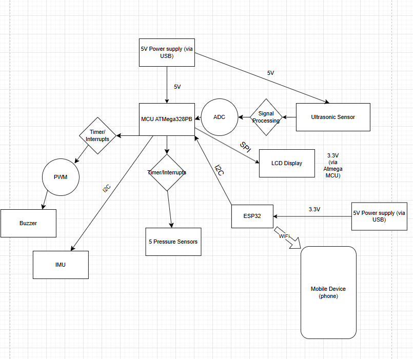
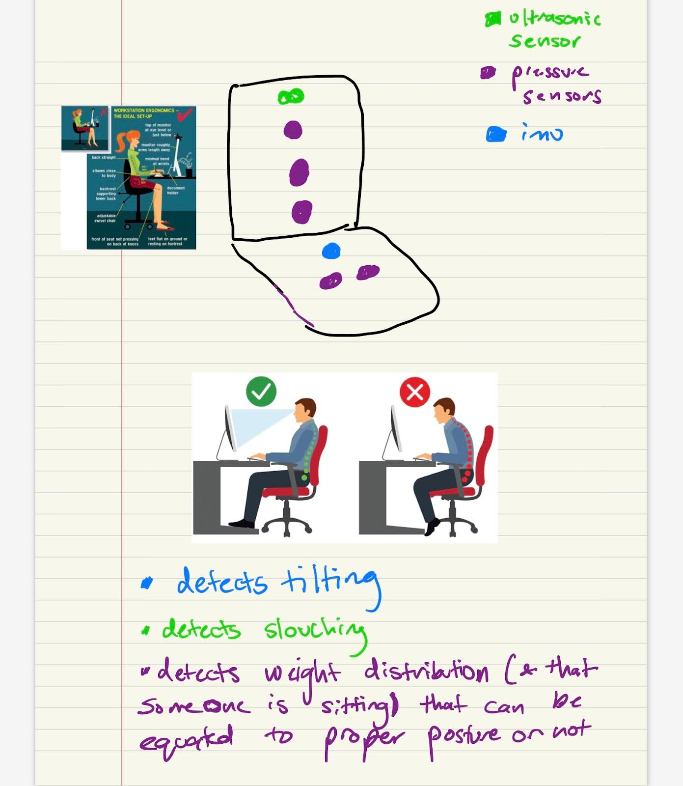

# final-project-skeleton

* Team Number: 16
* Team Name: Sam
* Team Members: Saanvi Mehta, Aagam Dalal saanvimmehta
* GitHub Repository URL: https://github.com/upenn-embedded/final-project-s25-sam
* GitHub Pages Website URL: [ for final submission]

## Final Project Proposal

### 1. Abstract

SlouchBuster is a device to help detect and correct poor posture.  It’s a cushion device that senses bad posture and alters the user depending on how much time has passed and what type of improper posture has been detected; specifically, it uses a buzzer after 3 minutes of bad posture, and an LCD display to alert & direct the user. The device tracks posture based on pressure sensors, an ultrasonic sensor, and an IMU, and it communicates via Wi-Fi to provide the user with a posture summary through a mobile app.

### 2. Motivation

In today’s digital age, where long hours are spent sitting at desks, on devices, and on couches, poor posture has become an increasingly prevalent issue. Many suffer from back and neck pain, headaches,  poor circulation, and other musculoskeletal problems due to improper sitting and slouching habits. However, poor posture often goes unnoticed and it can be hard to be aware of posture throughout the day. This can lead to chronic discomfort, decreased productivity, and long term health issues. 

The purpose of our project is to create a posture detection device that helps users maintain proper sitting posture by providing real-time feedback and alerts when poor posture is detected. We also aim to make our device user friendly and to give users the opportunity to track their progress over time. 

This project is interesting because  it integrates advanced embedded systems techniques to a real and widespread health problem. By using sensors, real-time feedback, and smart features, this posture detection device has the potential to improve users’ quality of lids by helping them be aware of their sitting habits (and hopefully training them to develop better sitting habits). 

This project brings together techniques such as power management, noise filtering, and wireless communication, which makes it a challenging and impactful solution. It’s a chance to merge technology with everyday health in a practical way & can help improve daily life.

### 3. System Block Diagram

### 4. Design Sketches

We will have most of our sensors and electronics embedded in a chair pillow. This includes our IMU, pressure sensors, buzzer, and ultrasonic sensor. The Atmega and ESP32 will be stored in a box connected to the side of the cushion, and the LCD will be on the armrest of the chair.

### 5. Software Requirements Specification (SRS)

The device must detect when the user is sitting in improper postures (such as slouching, tilting forward, or leaning) using a combination of IMU, pressure sensors, and ultrasonic sensors. The device must differentiate between good posture (e.g., sitting upright) and bad posture (e.g., slouching or leaning). The device must alert the user in real-time when bad posture is detected. The device must measure how long the user maintains poor posture. It should only trigger the buzzer after 2 minutes of poor posture and continue buzzing until the posture is corrected. After detecting poor posture for 2 minutes, the device should display clear corrective messages (e.g., "Sit Back," "Sit Straight," "Stop Leaning") on the LCD to guide the user toward better posture. The feedback should include auditory (buzzer) and visual (LCD display) cues to correct the posture. The device must store and log posture data (such as duration of poor posture and type of posture detected) for the user to track their improvements.

Validation Method: Simulate different postures (e.g., slouching, leaning forward, sitting upright) and verify that the IMU, pressure sensors, and ultrasonic sensors correctly detect each posture type.

Metric: Ensure that the device can accurately differentiate between good and bad posture, with no false positives (incorrectly detecting good posture as bad) and no false negatives (failing to detect bad posture).

Validation Method: Test the device by sitting in different postures for various durations and ensure that the buzzeractivates after 2 minutes of bad posture and continues until the posture is corrected. Also, test the LCD display to verify it shows the correct message after poor posture is detected.

Metric: The buzzer should sound within 5 seconds of poor posture detection and continue until the user adjusts their position. The LCD should display the appropriate corrective message within 5 seconds of the buzzer sounding.

Validation Method: Measure the time the device takes to detect bad posture and trigger the buzzer after 2 minutes. Ensure that once poor posture is corrected, the buzzer stops and the device logs the duration of the bad posture.

Metric: The buzzer should only be triggered after exactly 2 minutes of bad posture, and it should stop as soon as the user adjusts to correct posture.

Validation Method: Test that the LCD display shows the appropriate message after bad posture is detected for 2 minutes. For example, test sitting slouched and verify that the message reads "Sit Back" or "Sit Straight."

Metric: The correct posture correction message should be shown based on the type of poor posture detected.

Validation Method: Simulate a series of posture events (e.g., good posture for 5 minutes, bad posture for 2 minutes) and check that the device logs the duration of bad posture and stores this information in a local storage or sends it to a cloud database.

Metric: Ensure that the logged data is accurate and that it’s synced with a mobile app, showing progress over time. For example, if the user improves their posture over several sessions, the data should reflect a reduction in bad posture duration.

**5.1 Definitions, Abbreviations**

N/A

**5.2 Functionality**

| ID | Description |
| :---- | :---- |
| SRS-01 | The IMU will measure 3-axis acceleration with a sampling rate of 100Hz to capture the user's posture in real-time. This allows for precise tracking of any tilt or slouch in the torso. |
| SRS-02 | The seat pressure sensors will be sampled every 0.5 seconds to monitor the pressure distribution across the cushion, enabling the system to detect changes in posture or seating position as quickly as they occur. |
| SRS-03 | The IMU sensing and ultrasonic sensor sensing will only begin when the pressure sensors detect over 10% of maximum pressure applied, indicating the user is seated and their posture is being actively tracked. This reduces unnecessary processing when the user is not in the seated position. |
| SRS-04 | The Ultrasonic sensor will continuously measure the distance from the user's back to the cushion at a frequency of once every 0.5 seconds, allowing the system to detect how far the user has tilted or slouched. |
| SRS-05 | The buzzer will only buzz after bad posture was detected for more than 2 minutes. Until the posture isn’t corrected the buzzer won’t stop |
| SRS-06 | Depending on what factors triggered the event of bad posture, after 2 minutes, the LCD will display a certain message (e.g. sit back, sit straight, stop leaning, etc.) to help the user “detrigger” the buzzer |
| SRS-07 | Once the seat pressure threshold is passed and sensing begins, the back pressure sensors will be sampled every 0.5 seconds to monitor the pressure distribution across the cushion, enabling the system to detect changes in posture or seating position as quickly as they occur.  |
| SRS-07 | The system will log posture data (including the time spent in bad posture and the type of posture detected) for historical tracking. This data will be stored locally on the device and optionally synced to a cloud database via ESP32for long-term tracking. The data can be accessed by the user via the mobile app for progress monitoring. |

### 6. Hardware Requirements Specification (HRS)

The posture detection device must be capable of accurately detecting when a user is sitting with poor posture, such as slouching, leaning forward, or tilting to one side. It must use a combination of IMU (Inertial Measurement Unit), pressure sensors, and ultrasonic sensors to track the user’s movements and seating position in real-time. The IMU will monitor the angle of the user's body, detecting any tilting or slouching. The pressure sensors will measure the distribution of weight on the cushion to identify improper posture, such as leaning to one side. The ultrasonic sensor will track the distance between the user's back and the cushion to detect forward slouching or tilting. Once poor posture is detected for a sustained period (e.g., 2 minutes), the device must provide real-time feedback via a buzzer and an LCD display to alert the user to adjust their posture. The buzzer will continue to sound until the user corrects their position. The LCD will display specific corrective messages based on the type of poor posture detected, such as "Sit Back" or "Sit Straight."

During validation testing, each sensor's performance will be carefully evaluated. The IMU will be tested by moving the device through different angles, ensuring it detects slouching or tilting accurately at the required sampling rate of 100Hz. The pressure sensors will be validated by applying known weights and ensuring that pressure changes are detected accurately at 200ms intervals. The ultrasonic sensor will be tested by measuring the distance at different positions, confirming the accuracy of the readings within a ±1 cm tolerance. The buzzer will be tested by simulating poor posture and ensuring that it activates after 2 minutes, and remains on until the posture is corrected. The LCD display will be validated by displaying corrective messages, ensuring they are clearly visible under normal lighting conditions. Finally, the device’s power consumption will be measured to ensure it operates efficiently, with less than 300mA during normal use and entering low-power mode after 5 minutes of inactivity. The ESP32's ability to maintain a stable Wi-Fi connection will also be validated, ensuring seamless data synchronization with the mobile app within 5 seconds. These tests will verify that the system functions as intended and meets all design specifications.

### Validation Testing for HRS:

1. HRS-01 (IMU):  
   * Test: Measure the 3-axis acceleration and rotation data at different angles to ensure the IMU correctly detects slouching, tilting, and leaning movements.  
   * Metric: Check if the IMU can detect posture changes accurately by comparing with known movements (e.g., leaning forward and backward at specific angles) and ensuring it registers changes within 100Hz sampling rate.  
2. HRS-02 (Pressure Sensors):  
   * Test: Apply known weights at different positions on the cushion to ensure the pressure sensors provide consistent and accurate readings.  
   * Metric: Ensure that pressure readings are captured every 200ms and that the sensors can detect pressure within the range of 0.1-10kg.  
3. HRS-03 (Ultrasonic Sensor):  
   * Test: Place the user at different distances from the cushion and ensure the sensor detects the back-to-cushion distance accurately within ±1 cm.  
   * Metric: Ensure that the distance readings from the sensor match the actual distances and that the response time is less than 1 second.  
4. HRS-04 (Buzzer):  
   * Test: Test the buzzer for its sound level at different distances and verify that it triggers after 2 minutes of bad posture.  
   * Metric: The buzzer should reach a sound level of ≥ 70 dB at 1 meter and activate when poor posture is detected.  
5. HRS-05 (LCD Display):  
   * Test: Display the corrective posture messages on the LCD and verify visibility and readability under normal lighting conditions.  
   * Metric: Ensure the LCD resolution is at least 128x64 pixels and that the messages are clearly visible from a normal seated position.  
6. HRS-06 (Power Supply):  
   * Test: Measure the current consumption of the device under normal operation and in low-power mode.  
   * Metric: The device should consume less than 300mA during normal operation and enter low-power modeafter 5 minutes of inactivity.  
7. HRS-07 (ATmega328PB Microcontroller):  
   * Test: Verify the microcontroller’s ability to process data from all sensors and provide timely feedback.  
   * Metric: The microcontroller should process and provide feedback within 1 second of detecting poor posture.  
8. HRS-08 (ESP32 Wireless Communication):  
   * Test: Measure the range and reliability of the ESP32 in maintaining a stable Wi-Fi connection.  
   * Metric: The device should maintain a stable connection within 10 meters and sync data within 5 seconds.  
   2. Create 4 to 8 critical system requirements.

**6.1 Definitions, Abbreviations**

N/A

**6.2 Functionality**

| ID | Description |
| :---- | :---- |
| HRS-01 | The IMU (Inertial Measurement Unit) shall be able to detect and measure the 3-axis acceleration and rotationwith a sampling rate of 100Hz to accurately track the user’s body orientation (e.g., tilting, slouching, or leaning). This ensures the device detects posture changes in real time. |
| HRS-02 | The pressure sensors embedded in the cushion shall measure pressure at multiple points across the seating surface with a sampling frequency of 200ms to accurately monitor weight distribution and identify improper posture. The system should be able to detect pressure changes in the range of 0.1-10kg. |
| HRS-03 | The ultrasonic sensor shall measure the distance from the user’s back to the cushion with an accuracy of ±1 cmand a response time of less than 1 second. This sensor will help detect forward slouching or posture misalignment by tracking the user's position relative to the cushion. |
| HRS-04 | The buzzer shall provide audible feedback with a sound level of ≥ 70 dB at a distance of 1 meter, ensuring it is loud enough to alert the user when poor posture has been detected for more than 2 minutes. It shall be powered using the same power supply as the other components and be activated via the microcontroller. |
| HRS-05 | The LCD display shall have a resolution of at least 128x64 pixels and shall display posture correction messages, such as "Sit Back" or "Sit Straight," when bad posture is detected. The display shall be powered by the ATmega328PB microcontroller and shall be visible under normal lighting conditions from a seated position. |
| HRS-06 | The device shall be powered by a 5V DC power supply (preferably rechargeable via a USB-C port). The system shall consume less than 300mA during normal operation to ensure efficient battery life. A low-power mode shall be enabled when no user activity is detected for more than 5 minutes to extend battery life. |
| HRS-07 | The ATmega328PB microcontroller shall be responsible for processing sensor data (from the IMU, pressure sensors, and ultrasonic sensor) and controlling the feedback mechanisms (buzzer, LCD). The microcontroller shall be able to handle real-time data processing and provide feedback with a delay of less than 1 second between detection and alert. |
| HRS-08 | The ESP32 module shall enable wireless communication for syncing posture data with a mobile app via Wi-Fi. The module must maintain stable communication over typical room distances (up to 10 meters) and provide data synchronization within 5 seconds of a request from the app. |

### 7. Bill of Materials (BOM)

Sensors:

* US-100 ultrasonic sensor: This will be used to detect the position of the top of the user’s back. It will be connected to the MCU via GPIO.  
* 5 x Pressure sensors: These will be used to measure the pressure from the lower back of the user. These sensors are Force Sensitive Resistors, so we will use the MCUs ADC Pins to measure the voltage drop across them in order to measure the force applied to them.  
* IMU: this will be used to measure the pitch of the seat the user is sitting in. This will communicate with the MCU via I2C

Outputs:

* LCD Display: this will be used to provide a visual indication of any posture issues. This display will be connected to the MCU via SPI.  
* ESP32 (Feather S2): This device will be used to transmit the measurements to an IoT reciever such as Blynk. It will communicate with the MCU via I2C. This device will be powered by a USB connection (in the real product this would be connected to a battery, but that is not in this design)  
* Piezo Buzzer: this will be used as an additional indication to the user that their posture is poor. This will be connected to the MCU’s GPIO pins with PWM.

Details on pin use and cost of components can be found in the BoM:

[https://docs.google.com/spreadsheets/d/1pxjxf1A5-lorYqsxVKPRNCBl0wQBZ\_BLcbMW60\_J2v8/edit?usp=sharing](https://docs.google.com/spreadsheets/d/1pxjxf1A5-lorYqsxVKPRNCBl0wQBZ_BLcbMW60_J2v8/edit?usp=sharing)

### 8. Final Demo Goals

We will have our cushion attached to a chair in detkin. We will allow TAs to try it out. We will ensure the cushion fits the chair we will ultimately use and that the cushion is removable.

### 9. Sprint Planning

Sprint milestone planning will happen on the Sunday prior to each week. Saanvi and Aagam will meet either in person or via video conference to write down what was accomplished in the previous week, and what remains to be done. Then, we will divide up the work and commit our plans to the git repository.

We will divide up the work first for each subsegment of the project:

* Saanvi will work on getting the Buzzer, LCD and Force/Pressure Sensors working  
* Aagam will work on the ESP32-S2 feather, Ultrasonic sensor, and the code to handle interrupts working. 

Then as we get closer to the deadline, we will focus on integration. Here, both of us will be working together in lab to combine the individual pieces.

| Milestone  | Functionality Achieved | Distribution of Work |
| ---------- | ---------------------- | -------------------- |
| Sprint #1  | Individual components can communicate with Atmega328pb | Saanvi will integrate LCD, Buzzer, force sensor; Aagam the ESP32-S2, ultrasonic sensor, interrupts     |
| Sprint #2  | All components can perform their function in pieces (with simulated versions of other components in software). Begin integration with only sensors + buzzer for output | Same as sprint #1, but with joint work to integrate          |
| MVP Demo   | System works with sensors + buzzer + either display or esp32 | Saanvi and Aagam will work jointly on this integration  |
| Final Demo | Full functionality | Saanvi will add LCD functionality. Aagam and Saanvi will work on packaging the device  |

## Sprint Review #1

### Last week's progress

### Current state of project

### Next week's plan

## Sprint Review #2

### Last week's progress

### Current state of project

### Next week's plan

## MVP Demo

1. Show a system block diagram & explain the hardware implementation.
2. Explain your firmware implementation, including application logic and critical drivers you've written.
3. Demo your device.
4. Have you achieved some or all of your Software Requirements Specification (SRS)?

   1. Show how you collected data and the outcomes.
5. Have you achieved some or all of your Hardware Requirements Specification (HRS)?

   1. Show how you collected data and the outcomes.
6. Show off the remaining elements that will make your project whole: mechanical casework, supporting graphical user interface (GUI), web portal, etc.
7. What is the riskiest part remaining of your project?

   1. How do you plan to de-risk this?
8. What questions or help do you need from the teaching team?

## Final Project Report

Don't forget to make the GitHub pages public website!
If you’ve never made a GitHub pages website before, you can follow this webpage (though, substitute your final project repository for the GitHub username one in the quickstart guide):  [https://docs.github.com/en/pages/quickstart](https://docs.github.com/en/pages/quickstart)

### 1. Video

[Insert final project video here]

* The video must demonstrate your key functionality.
* The video must be 5 minutes or less.
* Ensure your video link is accessible to the teaching team. Unlisted YouTube videos or Google Drive uploads with SEAS account access work well.
* Points will be removed if the audio quality is poor - say, if you filmed your video in a noisy electrical engineering lab.

### 2. Images

[Insert final project images here]

*Include photos of your device from a few angles. If you have a casework, show both the exterior and interior (where the good EE bits are!).*

### 3. Results

*What were your results? Namely, what was the final solution/design to your problem?*

#### 3.1 Software Requirements Specification (SRS) Results

*Based on your quantified system performance, comment on how you achieved or fell short of your expected requirements.*

*Did your requirements change? If so, why? Failing to meet a requirement is acceptable; understanding the reason why is critical!*

*Validate at least two requirements, showing how you tested and your proof of work (videos, images, logic analyzer/oscilloscope captures, etc.).*

| ID     | Description                                                                                               | Validation Outcome                                                                          |
| ------ | --------------------------------------------------------------------------------------------------------- | ------------------------------------------------------------------------------------------- |
| SRS-01 | The IMU 3-axis acceleration will be measured with 16-bit depth every 100 milliseconds +/-10 milliseconds. | Confirmed, logged output from the MCU is saved to "validation" folder in GitHub repository. |

#### 3.2 Hardware Requirements Specification (HRS) Results

*Based on your quantified system performance, comment on how you achieved or fell short of your expected requirements.*

*Did your requirements change? If so, why? Failing to meet a requirement is acceptable; understanding the reason why is critical!*

*Validate at least two requirements, showing how you tested and your proof of work (videos, images, logic analyzer/oscilloscope captures, etc.).*

| ID     | Description                                                                                                                        | Validation Outcome                                                                                                      |
| ------ | ---------------------------------------------------------------------------------------------------------------------------------- | ----------------------------------------------------------------------------------------------------------------------- |
| HRS-01 | A distance sensor shall be used for obstacle detection. The sensor shall detect obstacles at a maximum distance of at least 10 cm. | Confirmed, sensed obstacles up to 15cm. Video in "validation" folder, shows tape measure and logged output to terminal. |
|        |                                                                                                                                    |                                                                                                                         |

### 4. Conclusion

Reflect on your project. Some questions to address:

* What did you learn from it?
* What went well?
* What accomplishments are you proud of?
* What did you learn/gain from this experience?
* Did you have to change your approach?
* What could have been done differently?
* Did you encounter obstacles that you didn’t anticipate?
* What could be a next step for this project?

## References

Fill in your references here as you work on your final project. Describe any libraries used here.
