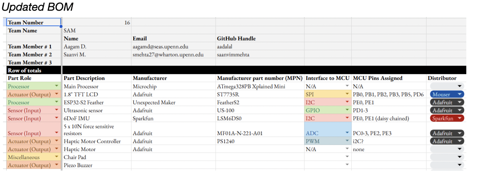
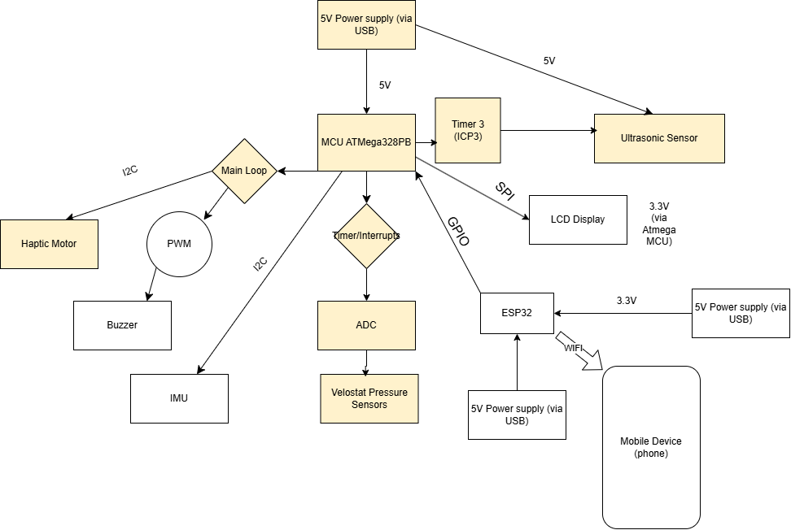
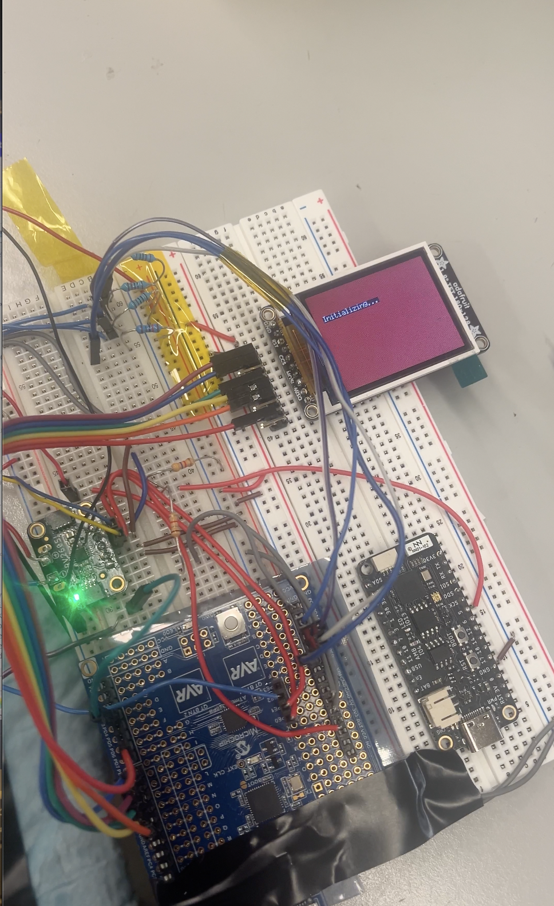
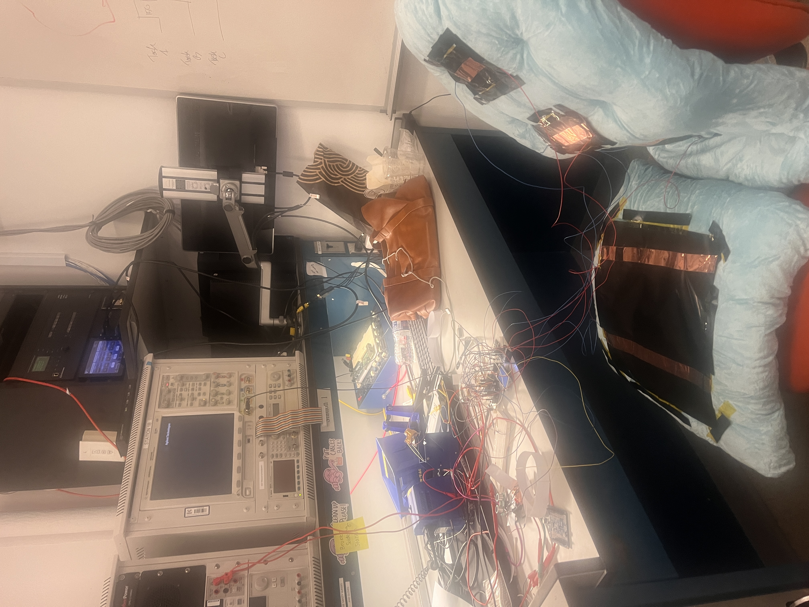
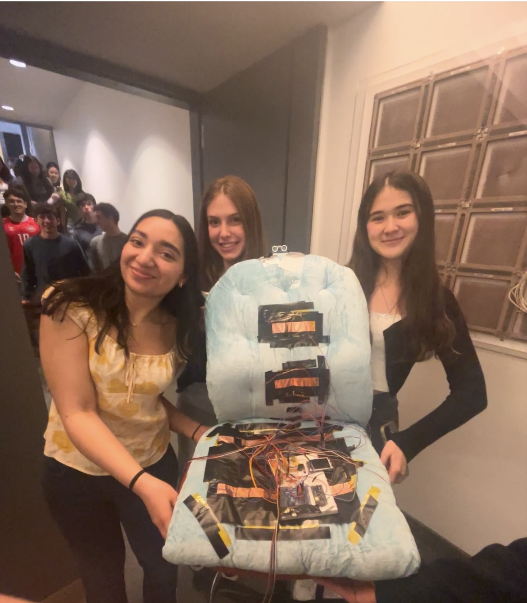

# final-project-skeleton

* Team Number: 16
* Team Name: Sam
* Team Members: Saanvi Mehta, Aagam Dalal saanvimmehta
* GitHub Repository URL: https://github.com/upenn-embedded/final-project-s25-sam
* GitHub Pages Website URL: https://upenn-embedded.github.io/final-project-s25-sam/

## Final Project Proposal

### 1. Abstract

SlouchBuster is a device to help detect and correct poor posture.  It’s a cushion device that senses bad posture and alters the user depending on how much time has passed and what type of improper posture has been detected; specifically, it uses a buzzer after 3 minutes of bad posture, and an LCD display to alert & direct the user. The device tracks posture based on pressure sensors, an ultrasonic sensor, and an IMU, and it communicates via Wi-Fi to provide the user with a posture summary through a mobile app.

### 2. Motivation

In today’s digital age, where long hours are spent sitting at desks, on devices, and on couches, poor posture has become an increasingly prevalent issue. Many suffer from back and neck pain, headaches,  poor circulation, and other musculoskeletal problems due to improper sitting and slouching habits. However, poor posture often goes unnoticed and it can be hard to be aware of posture throughout the day. This can lead to chronic discomfort, decreased productivity, and long term health issues.

The purpose of our project is to create a posture detection device that helps users maintain proper sitting posture by providing real-time feedback and alerts when poor posture is detected. We also aim to make our device user friendly and to give users the opportunity to track their progress over time.

This project is interesting because  it integrates advanced embedded systems techniques to a real and widespread health problem. By using sensors, real-time feedback, and smart features, this posture detection device has the potential to improve users’ quality of lids by helping them be aware of their sitting habits (and hopefully training them to develop better sitting habits).

This project brings together techniques such as power management, noise filtering, and wireless communication, which makes it a challenging and impactful solution. It’s a chance to merge technology with everyday health in a practical way & can help improve daily life.

### 3. System Block Diagram

### 4. Design Sketches

We will have most of our sensors and electronics embedded in a chair pillow. This includes our IMU, pressure sensors, buzzer, and ultrasonic sensor. The Atmega and ESP32 will be stored in a box connected to the side of the cushion, and the LCD will be on the armrest of the chair.

### 5. Software Requirements Specification (SRS)

The device must detect when the user is sitting in improper postures (such as slouching, tilting forward, or leaning) using a combination of IMU, pressure sensors, and ultrasonic sensors. The device must differentiate between good posture (e.g., sitting upright) and bad posture (e.g., slouching or leaning). The device must alert the user in real-time when bad posture is detected. The device must measure how long the user maintains poor posture. It should only trigger the buzzer after 2 minutes of poor posture and continue buzzing until the posture is corrected. After detecting poor posture for 2 minutes, the device should display clear corrective messages (e.g., "Sit Back," "Sit Straight," "Stop Leaning") on the LCD to guide the user toward better posture. The feedback should include auditory (buzzer) and visual (LCD display) cues to correct the posture. The device must store and log posture data (such as duration of poor posture and type of posture detected) for the user to track their improvements.

Validation Method: Simulate different postures (e.g., slouching, leaning forward, sitting upright) and verify that the IMU, pressure sensors, and ultrasonic sensors correctly detect each posture type.

Metric: Ensure that the device can accurately differentiate between good and bad posture, with no false positives (incorrectly detecting good posture as bad) and no false negatives (failing to detect bad posture).

Validation Method: Test the device by sitting in different postures for various durations and ensure that the buzzeractivates after 2 minutes of bad posture and continues until the posture is corrected. Also, test the LCD display to verify it shows the correct message after poor posture is detected.

Metric: The buzzer should sound within 5 seconds of poor posture detection and continue until the user adjusts their position. The LCD should display the appropriate corrective message within 5 seconds of the buzzer sounding.

Validation Method: Measure the time the device takes to detect bad posture and trigger the buzzer after 2 minutes. Ensure that once poor posture is corrected, the buzzer stops and the device logs the duration of the bad posture.

Metric: The buzzer should only be triggered after exactly 2 minutes of bad posture, and it should stop as soon as the user adjusts to correct posture.

Validation Method: Test that the LCD display shows the appropriate message after bad posture is detected for 2 minutes. For example, test sitting slouched and verify that the message reads "Sit Back" or "Sit Straight."

Metric: The correct posture correction message should be shown based on the type of poor posture detected.

Validation Method: Simulate a series of posture events (e.g., good posture for 5 minutes, bad posture for 2 minutes) and check that the device logs the duration of bad posture and stores this information in a local storage or sends it to a cloud database.

Metric: Ensure that the logged data is accurate and that it’s synced with a mobile app, showing progress over time. For example, if the user improves their posture over several sessions, the data should reflect a reduction in bad posture duration.

**5.1 Definitions, Abbreviations**

N/A

**5.2 Functionality**

| ID     | Description                                                                                                                                                                                                                                                                                                                                     |
| :----- | :---------------------------------------------------------------------------------------------------------------------------------------------------------------------------------------------------------------------------------------------------------------------------------------------------------------------------------------------- |
| SRS-01 | The IMU will measure 3-axis acceleration with a sampling rate of 100Hz to capture the user's posture in real-time. This allows for precise tracking of any tilt or slouch in the torso.                                                                                                                                                         |
| SRS-02 | The seat pressure sensors will be sampled every 0.5 seconds to monitor the pressure distribution across the cushion, enabling the system to detect changes in posture or seating position as quickly as they occur.                                                                                                                             |
| SRS-03 | The IMU sensing and ultrasonic sensor sensing will only begin when the pressure sensors detect over 10% of maximum pressure applied, indicating the user is seated and their posture is being actively tracked. This reduces unnecessary processing when the user is not in the seated position.                                                |
| SRS-04 | The Ultrasonic sensor will continuously measure the distance from the user's back to the cushion at a frequency of once every 0.5 seconds, allowing the system to detect how far the user has tilted or slouched.                                                                                                                               |
| SRS-05 | The buzzer will only buzz after bad posture was detected for more than 2 minutes. Until the posture isn’t corrected the buzzer won’t stop                                                                                                                                                                                                     |
| SRS-06 | Depending on what factors triggered the event of bad posture, after 2 minutes, the LCD will display a certain message (e.g. sit back, sit straight, stop leaning, etc.) to help the user “detrigger” the buzzer                                                                                                                               |
| SRS-07 | Once the seat pressure threshold is passed and sensing begins, the back pressure sensors will be sampled every 0.5 seconds to monitor the pressure distribution across the cushion, enabling the system to detect changes in posture or seating position as quickly as they occur.                                                              |
| SRS-07 | The system will log posture data (including the time spent in bad posture and the type of posture detected) for historical tracking. This data will be stored locally on the device and optionally synced to a cloud database via ESP32for long-term tracking. The data can be accessed by the user via the mobile app for progress monitoring. |

### 6. Hardware Requirements Specification (HRS)

The posture detection device must be capable of accurately detecting when a user is sitting with poor posture, such as slouching, leaning forward, or tilting to one side. It must use a combination of IMU (Inertial Measurement Unit), pressure sensors, and ultrasonic sensors to track the user’s movements and seating position in real-time. The IMU will monitor the angle of the user's body, detecting any tilting or slouching. The pressure sensors will measure the distribution of weight on the cushion to identify improper posture, such as leaning to one side. The ultrasonic sensor will track the distance between the user's back and the cushion to detect forward slouching or tilting. Once poor posture is detected for a sustained period (e.g., 2 minutes), the device must provide real-time feedback via a buzzer and an LCD display to alert the user to adjust their posture. The buzzer will continue to sound until the user corrects their position. The LCD will display specific corrective messages based on the type of poor posture detected, such as "Sit Back" or "Sit Straight."

During validation testing, each sensor's performance will be carefully evaluated. The IMU will be tested by moving the device through different angles, ensuring it detects slouching or tilting accurately at the required sampling rate of 100Hz. The pressure sensors will be validated by applying known weights and ensuring that pressure changes are detected accurately at 200ms intervals. The ultrasonic sensor will be tested by measuring the distance at different positions, confirming the accuracy of the readings within a ±1 cm tolerance. The buzzer will be tested by simulating poor posture and ensuring that it activates after 2 minutes, and remains on until the posture is corrected. The LCD display will be validated by displaying corrective messages, ensuring they are clearly visible under normal lighting conditions. Finally, the device’s power consumption will be measured to ensure it operates efficiently, with less than 300mA during normal use and entering low-power mode after 5 minutes of inactivity. The ESP32's ability to maintain a stable Wi-Fi connection will also be validated, ensuring seamless data synchronization with the mobile app within 5 seconds. These tests will verify that the system functions as intended and meets all design specifications.

### Validation Testing for HRS:

1. HRS-01 (IMU):

   * Test: Measure the 3-axis acceleration and rotation data at different angles to ensure the IMU correctly detects slouching, tilting, and leaning movements.
   * Metric: Check if the IMU can detect posture changes accurately by comparing with known movements (e.g., leaning forward and backward at specific angles) and ensuring it registers changes within 100Hz sampling rate.
2. HRS-02 (Pressure Sensors):

   * Test: Apply known weights at different positions on the cushion to ensure the pressure sensors provide consistent and accurate readings.
   * Metric: Ensure that pressure readings are captured every 200ms and that the sensors can detect pressure within the range of 0.1-10kg.
3. HRS-03 (Ultrasonic Sensor):

   * Test: Place the user at different distances from the cushion and ensure the sensor detects the back-to-cushion distance accurately within ±1 cm.
   * Metric: Ensure that the distance readings from the sensor match the actual distances and that the response time is less than 1 second.
4. HRS-04 (Buzzer):

   * Test: Test the buzzer for its sound level at different distances and verify that it triggers after 2 minutes of bad posture.
   * Metric: The buzzer should reach a sound level of ≥ 70 dB at 1 meter and activate when poor posture is detected.
5. HRS-05 (LCD Display):

   * Test: Display the corrective posture messages on the LCD and verify visibility and readability under normal lighting conditions.
   * Metric: Ensure the LCD resolution is at least 128x64 pixels and that the messages are clearly visible from a normal seated position.
6. HRS-06 (Power Supply):

   * Test: Measure the current consumption of the device under normal operation and in low-power mode.
   * Metric: The device should consume less than 300mA during normal operation and enter low-power modeafter 5 minutes of inactivity.
7. HRS-07 (ATmega328PB Microcontroller):

   * Test: Verify the microcontroller’s ability to process data from all sensors and provide timely feedback.
   * Metric: The microcontroller should process and provide feedback within 1 second of detecting poor posture.
8. HRS-08 (ESP32 Wireless Communication):

   * Test: Measure the range and reliability of the ESP32 in maintaining a stable Wi-Fi connection.
   * Metric: The device should maintain a stable connection within 10 meters and sync data within 5 seconds.

   2. Create 4 to 8 critical system requirements.

**6.1 Definitions, Abbreviations**

N/A

**6.2 Functionality**

| ID     | Description                                                                                                                                                                                                                                                                                                                                               |
| :----- | :-------------------------------------------------------------------------------------------------------------------------------------------------------------------------------------------------------------------------------------------------------------------------------------------------------------------------------------------------------- |
| HRS-01 | The IMU (Inertial Measurement Unit) shall be able to detect and measure the 3-axis acceleration and rotationwith a sampling rate of 100Hz to accurately track the user’s body orientation (e.g., tilting, slouching, or leaning). This ensures the device detects posture changes in real time.                                                          |
| HRS-02 | The pressure sensors embedded in the cushion shall measure pressure at multiple points across the seating surface with a sampling frequency of 200ms to accurately monitor weight distribution and identify improper posture. The system should be able to detect pressure changes in the range of 0.1-10kg.                                              |
| HRS-03 | The ultrasonic sensor shall measure the distance from the user’s back to the cushion with an accuracy of ±1 cmand a response time of less than 1 second. This sensor will help detect forward slouching or posture misalignment by tracking the user's position relative to the cushion.                                                                |
| HRS-04 | The buzzer shall provide audible feedback with a sound level of ≥ 70 dB at a distance of 1 meter, ensuring it is loud enough to alert the user when poor posture has been detected for more than 2 minutes. It shall be powered using the same power supply as the other components and be activated via the microcontroller.                            |
| HRS-05 | The LCD display shall have a resolution of at least 128x64 pixels and shall display posture correction messages, such as "Sit Back" or "Sit Straight," when bad posture is detected. The display shall be powered by the ATmega328PB microcontroller and shall be visible under normal lighting conditions from a seated position.                        |
| HRS-06 | The device shall be powered by a 5V DC power supply (preferably rechargeable via a USB-C port). The system shall consume less than 300mA during normal operation to ensure efficient battery life. A low-power mode shall be enabled when no user activity is detected for more than 5 minutes to extend battery life.                                    |
| HRS-07 | The ATmega328PB microcontroller shall be responsible for processing sensor data (from the IMU, pressure sensors, and ultrasonic sensor) and controlling the feedback mechanisms (buzzer, LCD). The microcontroller shall be able to handle real-time data processing and provide feedback with a delay of less than 1 second between detection and alert. |
| HRS-08 | The ESP32 module shall enable wireless communication for syncing posture data with a mobile app via Wi-Fi. The module must maintain stable communication over typical room distances (up to 10 meters) and provide data synchronization within 5 seconds of a request from the app.                                                                       |

### 7. Bill of Materials (BOM)

Sensors:

* US-100 ultrasonic sensor: This will be used to detect the position of the top of the user’s back. It will be connected to the MCU via GPIO.
* 5 x Pressure sensors: These will be used to measure the pressure from the lower back of the user. These sensors are Force Sensitive Resistors, so we will use the MCUs ADC Pins to measure the voltage drop across them in order to measure the force applied to them.
* IMU: this will be used to measure the pitch of the seat the user is sitting in. This will communicate with the MCU via I2C

Outputs:

* LCD Display: this will be used to provide a visual indication of any posture issues. This display will be connected to the MCU via SPI.
* ESP32 (Feather S2): This device will be used to transmit the measurements to an IoT reciever such as Blynk. It will communicate with the MCU via I2C. This device will be powered by a USB connection (in the real product this would be connected to a battery, but that is not in this design)
* Piezo Buzzer: this will be used as an additional indication to the user that their posture is poor. This will be connected to the MCU’s GPIO pins with PWM.

Details on pin use and cost of components can be found in the BoM:

[https://docs.google.com/spreadsheets/d/1pxjxf1A5-lorYqsxVKPRNCBl0wQBZ\_BLcbMW60\_J2v8/edit?usp=sharing](https://docs.google.com/spreadsheets/d/1pxjxf1A5-lorYqsxVKPRNCBl0wQBZ_BLcbMW60_J2v8/edit?usp=sharing)

### 8. Final Demo Goals

We will have our cushion attached to a chair in detkin. We will allow TAs to try it out. We will ensure the cushion fits the chair we will ultimately use and that the cushion is removable.

### 9. Sprint Planning

Sprint milestone planning will happen on the Sunday prior to each week. Saanvi and Aagam will meet either in person or via video conference to write down what was accomplished in the previous week, and what remains to be done. Then, we will divide up the work and commit our plans to the git repository.

We will divide up the work first for each subsegment of the project:

* Saanvi will work on getting the Buzzer, LCD and Force/Pressure Sensors working
* Aagam will work on the ESP32-S2 feather, Ultrasonic sensor, and the code to handle interrupts working.

Then as we get closer to the deadline, we will focus on integration. Here, both of us will be working together in lab to combine the individual pieces.

| Milestone  | Functionality Achieved                                                                                                                                                 | Distribution of Work                                                                               |
| ---------- | ---------------------------------------------------------------------------------------------------------------------------------------------------------------------- | -------------------------------------------------------------------------------------------------- |
| Sprint #1  | Individual components can communicate with Atmega328pb                                                                                                                 | Saanvi will integrate LCD, Buzzer, force sensor; Aagam the ESP32-S2, ultrasonic sensor, interrupts |
| Sprint #2  | All components can perform their function in pieces (with simulated versions of other components in software). Begin integration with only sensors + buzzer for output | Same as sprint #1, but with joint work to integrate                                                |
| MVP Demo   | System works with sensors + buzzer + either display or esp32                                                                                                           | Saanvi and Aagam will work jointly on this integration                                             |
| Final Demo | Full functionality                                                                                                                                                     | Saanvi will add LCD functionality. Aagam and Saanvi will work on packaging the device              |

## Sprint Review #1

### Last week's progress

Last week, we placed orders for all required components and began initial development on the IoT aspect of the project using the ESP32-S2 Feather. While several parts are still pending arrival in the Detkin lab, we moved forward by finalizing the hardware and firmware mapping--including detailed documentation of pin assignments for each peripheral based on the revised parts list. This pinout map will serve as the foundation for consistent firmware development across modules.

### Current state of project

At present, a few components have arrived, such as the buzzer and the seat cushion, but key parts like the pressure sensors and haptic motor are still in transit. As a result, full hardware integration is delayed. In the meantime, we have shifted focus to the configuration of peripherals that are already available--specifically, initializing the ultrasonic sensor, IMU, and LCD. We’ve begun low-level setup and plan to validate communication protocols, confirm sensor output formatting, and establish basic functionality through test routines. The next steps involve implementing a generic I2C driver, building the firmware backbone, and launching the Blynk-based interface for remote monitoring.

### Next week's plan

Goals:

1. Have I2C driver that can talk to another I2C device (e.g., an IMU) without any device-specific logic (2hrs)
2. Create a blynk setup that can turn mocked signals from the MCU into charts/graphs (2hrs)

   1. This should use the same pins we plan to communicate the data via once we integrate the actual hardware
3. Implement foundational firmware structure on the ATmega328PB including clock setup, pin initialization, modular organization to support sensor and actuator integration, ISR template definitions, and overall architecture. This will form the firmware backbone and allow rapid development of individual modules in upcoming sprints (3.5hrs)
4. A rough version of the main loop our code will be running with. We will write this and test it with the sensors. (30min)

Saanvi will do 3 & 4

Aagam will do 1 & 2

Definition of "Done"

1. Successfully compiles and transmits/receives data with a connected I2C device (e.g., IMU)
2. Mock data visible in the Blynk app via charts or indicators
3. Peripheral headers and initialization functions implemented. Clean modular structure in place for integrating future sensor/actuator thresholds
4. Loop compiles and runs. Able to call placeholder functions for reading sensors and updating actuators

## Sprint Review #2

### Last week's progress

Saanvi finalized the configuration and initialization of all peripheral components connected to the ATmega328PB microcontroller. This included the ADC channels for force sensors & ultrasonic sensor and digital output control for the buzzer and LCD (but did not include imu as we needed the i2c set up first). She began with the timer configurations to support both time-sensitive tasks and future interrupt-driven operations. In addition, Saanvi initiated the development of interrupt service routines (ISRs) for force sensor data acquisition. These routines are designed to handle high-priority posture events by sampling analog pressure values and performing threshold-based detection. The ISR implementation is structured to have 2 pressure sensors on the seat be continually sesning and the rest of the peripherals "sleeping" till weight is detected.

Proof of Work in Github ^ (code - no images here because we've been doing firmware not hardware- now that all parts have arrived we will be doing more sensor testing and wiring to further develop firmware and begin assembling our device)

Aagam -

Aagam developed and modularized the I2C communication driver to support multi-device coordination between the ATmega328PB and the ESP32-S2 Feather. The driver was written to ensure compatibility with both microcontrollers and to allow flexible integration of additional I2C-based sensors. Parallel to this, Aagam configured the ESP32-S2 Feather to serve as the central wireless node using Blynk for IoT-based remote posture monitoring. Although sensor integration has not yet been completed, the foundational Blynk setup was successfully implemented and validated.

Proof of Work in Github ^ (code - no images here because we've been doing firmware not hardware- now that all parts have arrived we will be doing more sensor testing and wiring to further develop firmware and begin assembling our device)

### Current state of project

We have mainly worked on our firmware--specifically structuring and setting up our firmware architecture and core peripheral initialization routines. This week we received the remainder of our hardware components. Now we must 1) test all connected peripherals to empirically determine the thresholds and trigger conditions that will define "bad posture" and allow us to distinguish between different types of postural deviations such as slouching vs leaning 2) use these empirical results to finalize and calibrate our ISRs for real-time responsiveness and 3) integrate logic for posture state classification and corresponding feedback mechanisms (e.g. buzzer alerts and LCD messages) into the main control loop. Our firmware’s foundation is now well-developed. The next phase involves refining ISR sequencing to ensure reliable execution order particularly making sure that time-critical sensing from both force sensors is not disrupted by secondary interrupt events. In terms of system integration we will begin testing data flow between the ATmega328PB and the ESP32-S2 via I2C to prepare for wireless telemetry and ensure smooth coordination between posture detection and real-time data transmission.

### Next week's plan

1. Peripheral Threshold Calibration (3hrs) - Begin experimental testing of the force and pressure sensors under various postural conditions to establish quantitative thresholds for identifying "bad posture." This includes collecting baseline data for normal seating and logging deviations caused by slouching, leaning, or uneven weight distribution. These thresholds will inform both real-time posture classification and ISR logic.
2. Finalize and Optimize ISR Implementation (2.5 hrs)- Using the results from sensor calibration, finalize the interrupt service routines to ensure they trigger accurately based on posture events. This includes refining the prioritization of ISRs to prevent timing conflicts, particularly ensuring that force sensor sampling occurs with minimal latency and is not interrupted by secondary tasks such as LCD updates or buzzer activation.
3. Develop Posture Classification Logic (5 hrs)- Implement and test posture classification algorithms in firmware, using sensor data to categorize user posture states. These states will be mapped to specific feedback actions (e.g., gradual buzzer ramp-up, instructional LCD prompts) based on duration and severity of poor posture.
4. ESP32-S2 & I2C Integration Testing (2.5hrs) - Establish and test communication between the ATmega328PB and ESP32-S2 Feather over I2C. Begin transferring mock posture data to verify the communication pipeline and prepare for integration with Blynk for wireless monitoring. Confirm that the ESP32-S2 can receive, parse, and transmit this data in near-real time.
5. LCD Display and Buzzer Feedback Routines (2hrs) - Finalize the behavior of the buzzer and LCD display to ensure they provide timely and informative user feedback based on the detected posture state. This includes configuring timer-based routines for buzzer ramping and designing visual feedback sequences for the LCD.

Saanvi will do 1, 2

Aagam and Saanvi will do 3

Aagam will do 4, 5

Definition of "Done"

1. Force and pressure sensor data collected for at least 3 distinct posture states. Threshold values documented and verified through repeated tests. Calibration results integrated into posture detection planning
2. ISRs coded and mapped to correct interrupt vectors. Verified ISR System tested to ensure ISR execution does not interfere with force sensor readings
3. Logic implemented to classify at least 3 posture types using real-time sensor data. State transitions tested and debugged using live input. Corresponding actions (buzzer/LCD) linked to posture states
4. Successful I2C communication between ATmega328PB and ESP32-S2. Transmission of mock posture data confirmed. ESP32-S2 verified to send parsed data to Blynk interface
5. Buzzer responds to posture events with correct timing and intensity. LCD displays clear, context-specific messages. Both peripherals tested together in an integrated feedback cycle

## MVP Demo

1. Show a system block diagram & explain the hardware implementation.

The yellow highlighted items are the elements we included in our MVP demo.

2. Explain your firmware implementation, including application logic and critical drivers you've written.

Our firmware implementation for SlouchBuster is structured around a modular, interrupt-driven embedded architecture that prioritizes energy efficiency, real-time responsiveness, and precise sensor integration. The core application logic revolves around the detection of user presence through pressure sensors, followed by real-time posture evaluation using a combination of analog pressure readings and ultrasonic distance measurements. Based on posture analysis, the system provides haptic feedback using a DRV2605 haptic motor driver via I2C communication.

The system begins with initial peripheral configuration, including UART for debugging, ADC for pressure sensing, Timer2 for periodic checks, Timer3 for ultrasonic echo capture via input capture interrupts, I2C for DRV2605 control, and GPIOs for interfacing with sensors and actuators. A key aspect of initialization involves a pressure threshold calibration routine ( init_pressure_thresholds()), where the system samples all four pressure sensors (connected to PC0–PC3) 100 times and computes a baseline threshold for each. This dynamic calibration accounts for the pressure sensor inaccuracies and unpredictable starting values.This brings the readings of the pressure sensors into a meaningful range relative to the microcontroller’s 10-bit ADC, which maps input voltages from 0 to 5V into values from 0 to 1023. Since the sensors provide an analog voltage that increases with applied pressure, we set the threshold slightly above the average idle reading to detect whether sufficient force (i.e., a person sitting) is being applied. Comparing the live ADC reading against this calibrated threshold allows us to make accurate determinations about whether the cushion is being sat on.

The application logic is structured around a finite state-like structure controlled via global flags. The sensing_enabled flag determines whether the system is actively monitoring posture. Initially, the system is in a passive state, periodically checking the primary seat pressure sensor (PC0) every 10ms via Timer2’s Compare Match ISR. If PC0's pressure exceeds its threshold for five consecutive intervals (3 seconds total), sensing_enbaled is set, indicating that a user is seated and the system should begin full sensing. Conversely, if pressure remains below the threshold for 20 intervals (indicating the user has stood up), sensing is disabled again, which helps conserve power and avoid unnecessary alerts.

Once sensing is active, the firmware enters a loop that continuously performs posture analysis. The first step is to measure distance using an ultrasonic sensor, which determines how far the user's back is from the cushion. The ultrasonic sensor is driven using Timer3 in Input Capture mode:send_trigger_pulse()) initiates a 10μs TRIG pulse on PE2, and we have a helper function to configure the timer to detect the rising and falling edges of the ECHO signal on PE3 (ICP3). The ISR for TIMER3 CAPT captures the start and stop times of the echo pulse and computes the total duration, which is then converted to distance in centimeters.

Simultaneously, the system reads from three additional pressure sensors (PC1–PC3). These sensors are positioned to detect leaning or uneven pressure distribution, which, along with the ultrasonic distance, form the basis for posture assessment. If any of these sensors read values below their calibrated thresholds (indicating pressure has shifted away from the upper middle or lower parts of the back), or if the ultrasonic distance exceeds a slouch threshold (e.g., 20 cm), the system interprets this as poor posture.

In response to detected bad posture, the firmware triggers the DRV2605 haptic motor driver over I2C to deliver a short vibration. The I2C driver is initialized early on, and the DRV2605 is configured using drv2605_init(). ) Upon bad posture detection, a vibration pattern is selected, and the effect is started by writing to DRV2605_REG_G0.

To support real-time debugging and validation, we  used Uart, and this was critical during development for observing sensor readings, distance measurements, threshold levels, and state transitions like sensing enablement or posture correction.

In earlier iterations, additional components like the ST7735 LCD screen were used to visually prompt the user with messages like “Sit up straight,” and the codebase retains support for this. However, we're running into some difficulties with this so did not include in our demo.

5. Demo your device.

(Done in lab)

4. Have you achieved some or all of your Software Requirements Specification (SRS)?

| ID     | Description                                                                                                                                                                                                                                                                                                                                                                                                                                                                                                                                                                                                                                                                                     |
| :----- | :---------------------------------------------------------------------------------------------------------------------------------------------------------------------------------------------------------------------------------------------------------------------------------------------------------------------------------------------------------------------------------------------------------------------------------------------------------------------------------------------------------------------------------------------------------------------------------------------------------------------------------------------------------------------------------------------- |
| SRS-01 | The IMU will measure 3-axis acceleration with a sampling rate of 100Hz to capture the user's posture in real-time. This allows for precise tracking of any tilt or slouch in the torso.**MVP**: We did not implement the IMU in the MVP.                                                                                                                                                                                                                                                                                                                                                                                                                                                  |
| SRS-02 | **Original SRS** The seat pressure sensors will be sampled every 0.5 seconds to monitor the pressure distribution across the cushion, enabling the system to detect changes in posture or seating position as quickly as they occur. **MVP**: We achieved this goal by polling the pressure sensor on every iteration of our main loop, which operates with a delay of ~60ms per loop of busy wait time. In practice, the delay is likely higher becuase of additional time spent polling the ADCs and getting a measurement from the ultrasonic sensor. However, when we added serial monitor prints, we were able to observe that the loop executed more than 2 times per second. |
| SRS-03 | The IMU sensing and ultrasonic sensor sensing will only begin when the pressure sensors detect over 10% of maximum pressure applied, indicating the user is seated and their posture is being actively tracked. This reduces unnecessary processing when the user is not in the seated position.**MVP**: We did did not support the IMU and had trouble getting the ultrasonic sensor fully working in our MVP demo.                                                                                                                                                                                                                                                                      |
| SRS-04 | The Ultrasonic sensor will continuously measure the distance from the user's back to the cushion at a frequency of once every 0.5 seconds, allowing the system to detect how far the user has tilted or slouched.**MVP**: We were not able to fully implement this logic for the demo as we were not able to get our ultrasonic sensor to read reasonable values. However, in our main loop we did include the ultrasonic sensor code, and we were able to iterate the main loop faster than 2x per second.                                                                                                                                                                               |
| SRS-05 | The buzzer will only buzz after bad posture was detected for more than 2 minutes. Until the posture isn’t corrected the buzzer won’t stop.**MVP**: In the MVP, we pulsed the haptic motor (rather than the buzzer) immediately rather than after 2 minutes as we found it to be more useful (2 minutes is a long time to wait to correct bad posture). Otherwise, we completed this SRS.                                                                                                                                                                                                                                                                                                |
| SRS-06 | Depending on what factors triggered the event of bad posture, after 2 minutes, the LCD will display a certain message (e.g. sit back, sit straight, stop leaning, etc.) to help the user “detrigger” the buzzer.**MVP**: We did not implement the LCD or posture categorization for the demo                                                                                                                                                                                                                                                                                                                                                                                            |
| SRS-07 | Once the seat pressure threshold is passed and sensing begins, the back pressure sensors will be sampled every 0.5 seconds to monitor the pressure distribution across the cushion, enabling the system to detect changes in posture or seating position as quickly as they occur.**MVP**: As mentioned, the, main loop iterated at >2 times per second and polled all 3 back pressure sensors. Thus this goal was met.                                                                                                                                                                                                                                                                   |
| SRS-08 | The system will log posture data (including the time spent in bad posture and the type of posture detected) for historical tracking. This data will be stored locally on the device and optionally synced to a cloud database via ESP32for long-term tracking. The data can be accessed by the user via the mobile app for progress monitoring.**MVP**: IoT integration was not completed for the MVP                                                                                                                                                                                                                                                                                     |

5. Have you achieved some or all of your Hardware Requirements Specification (HRS)?
   1. Show how you collected data and the outcomes.

| ID     | Description                                                                                                                                                                                                                                                                                                                                                                                                                                                                                                                                                                                                   |
| :----- | :------------------------------------------------------------------------------------------------------------------------------------------------------------------------------------------------------------------------------------------------------------------------------------------------------------------------------------------------------------------------------------------------------------------------------------------------------------------------------------------------------------------------------------------------------------------------------------------------------------ |
| HRS-01 | The IMU (Inertial Measurement Unit) shall be able to detect and measure the 3-axis acceleration and rotationwith a sampling rate of 100Hz to accurately track the user’s body orientation (e.g., tilting, slouching, or leaning). This ensures the device detects posture changes in real time.**MVP**: We did not implement the IMU for the MVP.                                                                                                                                                                                                                                                      |
| HRS-02 | The pressure sensors embedded in the cushion shall measure pressure at multiple points across the seating surface with a sampling frequency of 200ms to accurately monitor weight distribution and identify improper posture. The system should be able to detect pressure changes in the range of 0.1-10kg.**MVP**: We sampled the 3 pressure sensors on the cushions at >5 times per second (we estimated the period of the loop to be 60ms)                                                                                                                                                          |
| HRS-03 | The ultrasonic sensor shall measure the distance from the user’s back to the cushion with an accuracy of ±1 cmand a response time of less than 1 second. This sensor will help detect forward slouching or posture misalignment by tracking the user's position relative to the cushion.**MVP**: We did not fully implement the ultrasonic sensor for the MVP as we were not able to get sensible values out of the green ultrasonic sensors.                                                                                                                                                         |
| HRS-04 | The buzzer shall provide audible feedback with a sound level of ≥ 70 dB at a distance of 1 meter, ensuring it is loud enough to alert the user when poor posture has been detected for more than 2 minutes. It shall be powered using the same power supply as the other components and be activated via the microcontroller.**MVP**: We did not implement the buzzer, but we did use a haptic motor, which we believe is a more effective means of achieving the same goal of alerting the user.                                                                                                      |
| HRS-05 | The LCD display shall have a resolution of at least 128x64 pixels and shall display posture correction messages, such as "Sit Back" or "Sit Straight," when bad posture is detected. The display shall be powered by the ATmega328PB microcontroller and shall be visible under normal lighting conditions from a seated position.**MVP**: We did not implement the LCD display in the MVP demo.                                                                                                                                                                                                        |
| HRS-06 | The device shall be powered by a 5V DC power supply (preferably rechargeable via a USB-C port). The system shall consume less than 300mA during normal operation to ensure efficient battery life. A low-power mode shall be enabled when no user activity is detected for more than 5 minutes to extend battery life.**MVP**: We achieved a decreased power mode by turning off sensing if the bottom pad of the chair did not detect pressure for >1 minute.                                                                                                                                          |
| HRS-07 | The ATmega328PB microcontroller shall be responsible for processing sensor data (from the IMU, pressure sensors, and ultrasonic sensor) and controlling the feedback mechanisms (buzzer, LCD). The microcontroller shall be able to handle real-time data processing and provide feedback with a delay of less than 1 second between detection and alert.**MVP**: The only output for this demo was the haptic motor, which achieved the goal of <1 second of latency between an event and it's resolution. We checked this by using serial prints and comparing this against the timing of the buzzer. |
| HRS-08 | The ESP32 module shall enable wireless communication for syncing posture data with a mobile app via Wi-Fi. The module must maintain stable communication over typical room distances (up to 10 meters) and provide data synchronization within 5 seconds of a request from the app.**MVP**: We did not implement IoT for the MVP.                                                                                                                                                                                                                                                                       |

6. Show off the remaining elements that will make your project whole: mechanical casework, supporting graphical user interface (GUI), web portal, etc.

   1) IMU integration - We plan to add an inertial measurement unit (IMU) to detect changes in body orientation and movement. t will be interfaced via I2C..
   2) Ultrasonic sensor debugging - While our ultrasonic logic definitely works, we're getting inaccurate readings from the actual sensor (we've done a multitude of tests to confirm this is a sensor not fimrware issue. We are trying to find a way to make our readings more accurate
   3) Posture classification (will test proper force sensors to assist with this) - Our current posture detection is threshold-based across the board, but we want to have the 3 back sensors force sensor Ipatterns, IMU data, and the ultrasonic sensor data enable us to have types of bad posture classification logic.
   4) We plan to use the ESP32 for either data logging. This will allow users to track posture trends over time and receive insights remotely.
   5) Though the ST7735 LCD has been integrated previously, we are troubleshooting occasional display initialization failures and plan to finalize the UI design, positioning, and message logic. The LCD is being used to communicate to the user that they need to fix their posture
   6) Mechanical and Visual Presentation - making the device look and feel like a polished product. This includes wire management, enclosing the electronics, and not having our peripherals exposed on the cushion.
7. What is the riskiest part remaining of your project?
   Though it may seem minor compared to the technical challenges, the only part that seems truly risky (risky as in may break our minimum viable product) is #6 making our project presentable. This is because our system is inherently hardware-heavy, and multiple peripherals (pressure sensors, IMU, ultrasonic sensor, LCD, and buzzer) are distributed across the surface and edges of the cushion. We had some instances of things pulling, falling, and disconnecting easily when we were testing. Ensuring everything remains mechanically secure, unobtrusive to the user, and visually clean - while still being debug-accessible - poses a significant challenge. If wires are dislodged or parts shift, it could undermine the demo or degrade sensor readings, breaking our mvp functionality.

   1. How do you plan to de-risk this? To derisk this we plan to 1) create a seat cover for our seat cushion, encase the atmega on a box to the side, extend our wires so the lcd can be comfortably in front of the user on the table, organizing and grouping the wires, stringing them from the back so the user can't accidentally tamper with them, and soldering our connections.
8. What questions or help do you need from the teaching team?

Help with IMU integration would be helpful as both Aagam and I are not confident with that & we've been running into a lot of ultrasonic sensor issues as we mentioned during our demo which don't seem to be firmware related, so maybe some help / advice with this piece!

## Final Project Report

Don't forget to make the GitHub pages public website!
If you’ve never made a GitHub pages website before, you can follow this webpage (though, substitute your final project repository for the GitHub username one in the quickstart guide):  [https://docs.github.com/en/pages/quickstart](https://docs.github.com/en/pages/quickstart)

### 1. Video

**https://www.dropbox.com/scl/fo/702uyo3b11zsc03u807cp/AIPMQNEChR5ZowI8P7IOuxo?rlkey=1u3yia7crl2wny4mzd332s2i4&st=c8gdctuw&dl=0**

VIDEO

* The video must demonstrate your key functionality.
* The video must be 5 minutes or less.
* Ensure your video link is accessible to the teaching team. Unlisted YouTube videos or Google Drive uploads with SEAS account access work well.
* Points will be removed if the audio quality is poor - say, if you filmed your video in a noisy electrical engineering lab.

### 2. Images

[Insert final project images here]

*Include photos of your device from a few angles. If you have a casework, show both the exterior and interior (where the good EE bits are!).*

### 3. Results

*What were your results? Namely, what was the final solution/design to your problem?*

Our final solution, SlouchBuster, is a real-time posture correction cushion that uses pressure sensors, an ultrasonic sensor, and an IMU to track slouching, leaning, and other poor postural behaviors. The system provides immediate haptic feedback using a motor driver and displays guiding messages on an LCD. It also supports enabling/disabling sensing based on presence detection and includes sensor calibration at startup. While some requirements were adjusted during development (e.g. using a haptic motor instead of a buzzer, and being unable to consistently / accurately define different kinds of posture), our system performed in tracking the user's posture, identifying poor posture, and reacting quickly to it guiding the user.

#### 3.1 Software Requirements Specification (SRS) Results

*Based on your quantified system performance, comment on how you achieved or fell short of your expected requirements.*

**NOTE: our main.c final version is "final_main.c"**

*Did your requirements change? If so, why? Failing to meet a requirement is acceptable; understanding the reason why is critical!*

*Validate at least two requirements, showing how you tested and your proof of work (videos, images, logic analyzer/oscilloscope captures, etc.).*

**VALIDATION FOR SRS-01, 02, 03, 05, & 07 is in pictures and videos of serial monitor prints & the lcd screen changes in the validation folder in this link:** https://www.dropbox.com/scl/fo/702uyo3b11zsc03u807cp/AIPMQNEChR5ZowI8P7IOuxo?rlkey=1u3yia7crl2wny4mzd332s2i4&st=t1vhbi3w&dl=0

| ID             | Description                                                                                                                                                                                                                                                                                                 | Validation Outcome                                                                                                                                                                                                                                                                                                                                                                                                                                                                                                                                                                                                         |
| -------------- | ----------------------------------------------------------------------------------------------------------------------------------------------------------------------------------------------------------------------------------------------------------------------------------------------------------- | -------------------------------------------------------------------------------------------------------------------------------------------------------------------------------------------------------------------------------------------------------------------------------------------------------------------------------------------------------------------------------------------------------------------------------------------------------------------------------------------------------------------------------------------------------------------------------------------------------------------------- |
| Example SRS-01 | The IMU 3-axis acceleration will be measured with 16-bit depth every 100 milliseconds +/-10 milliseconds.                                                                                                                                                                                                   | Confirmed, logged output from the MCU is saved to "validation" folder in GitHub repository.                                                                                                                                                                                                                                                                                                                                                                                                                                                                                                                                |
| SRS-01         | The IMU will measure 3-axis acceleration with a sampling rate of 100Hz to capture the user's posture in real-time.                                                                                                                                                                                          | Confirmed, live readings from x, y, and z gyro axes were printed over UART in the final loop. Smoothing filter applied. Logged Output validates this                                                                                                                                                                                                                                                                                                                                                                                                                                                                       |
| SRS-02         | Pressure sensors sampled every 0.5s to track seating changes.                                                                                                                                                                                                                                               | Cofirmed (slightly adjusted to higher frequency readings) Sensors were read every ~60ms as this helped us better track the user's posture & react quicker. Logs in serial monitor validated this                                                                                                                                                                                                                                                                                                                                                                                                                           |
| SRS-03         | The IMU, pressure sensors, and ultrasonic sensor sensing will only begin when the pressure sensors detect over 10% of maximum pressure applied, indicating the user is seated and their posture is being actively tracked. This reduces unnecessary processing when the user is not in the seated position. | Cofirmed (slightly adjusted for more accuracy) Sensors only began sensing after 5 counts of pressure exceeding the threshold was registered in a row. This threshold was dynamically determined from the threshold calibration at the beginning for more consistency working with the pressure sensors, and the 5 counts were spaced by __ ms.                                                                                                                                                                                                                                                                             |
| SRS-05         | The Ultrasonic sensor will continuously measure the distance from the user's back to the cushion at a frequency of once every 0.5 seconds, allowing the system to detect how far the user has slouched                                                                                                      | Confirmed but at a higher frequency for more immediate responses.                                                                                                                                                                                                                                                                                                                                                                                                                                                                                                                                                          |
| SRS-06         | The buzzer will only buzz after bad posture was detected for more than 2 minutes. Until the posture isn’t corrected the buzzer won’t stop.                                                                                                                                                                | Confirmed (greatly adjusted for better design). Instead now we had a haptic buzzer at the users back that automatically buzzed when a user has bad posture. This change was made so that rather than an audio cue the user would get a haptic cue & would get the cue as soon as their posture regresses rather than letting them sit with bad posture for 2 minutes.)                                                                                                                                                                                                                                                     |
| SRS-07         | Depending on what factors triggered the event of bad posture, after 2 minutes, the LCD will display a certain message (e.g. sit back, sit straight, stop leaning, etc.) to help the user “detrigger” the buzzer                                                                                           | Partially done, partially adjusted, partially not able to achieve. We were able to display messages on the LCD to alert to user of when they had good & bad posture (and when they weren't sitting on the chair) - we chose to adjust so that we'd have a faster response to sitting so that the user would only need to wait 5 counts as opposed to 2 minutes for the sensing to begin. What we weren't able to achieve was the different categorizations of bad posture and assigning a unique lcd screen to them because our pressure sensors weren't accurate enough to detect these small pressure shifts on the back |

| ID continued | Description Continued                                                                                                                                                                                                                                                                                                                           | Validation Continued                                                                                                                                                                                                    |
| ------------ | ----------------------------------------------------------------------------------------------------------------------------------------------------------------------------------------------------------------------------------------------------------------------------------------------------------------------------------------------- | ----------------------------------------------------------------------------------------------------------------------------------------------------------------------------------------------------------------------- |
| SRS-08       | Once the seat pressure threshold is passed and sensing begins, the back pressure sensors will be sampled every 0.5 seconds to monitor the pressure distribution across the cushion, enabling the system to detect changes in posture or seating position as quickly as they occur.                                                              | Confirmed (slightly adjusted to higher frequency readings). Sensors were read every ~60ms                                                                                                                              |
| SRS-09       | The system will log posture data (including the time spent in bad posture and the type of posture detected) for historical tracking. This data will be stored locally on the device and optionally synced to a cloud database via ESP32for long-term tracking. The data can be accessed by the user via the mobile app for progress monitoring. | Partially Achieved, we were able to log bad posture & it's duration to a web application via the ESP32, but we were unable to also record the type of bad posture as we were unable to classify it as previously noted. |

#### 3.2 Hardware Requirements Specification (HRS) Results

*Based on your quantified system performance, comment on how you achieved or fell short of your expected requirements.*

*Did your requirements change? If so, why? Failing to meet a requirement is acceptable; understanding the reason why is critical!*

*Validate at least two requirements, showing how you tested and your proof of work (videos, images, logic analyzer/oscilloscope captures, etc.).*

**VALIDATION FOR HRS-01, 02, 05, 06,  & 07 (and partially 08 & 03) is in pictures and videos of serial monitor prints, the lcd screen changes, the system as a whole, the imu and pressure sensors, and the esp32 module in the validation folder in this link:** https://www.dropbox.com/scl/fo/702uyo3b11zsc03u807cp/AIPMQNEChR5ZowI8P7IOuxo?rlkey=1u3yia7crl2wny4mzd332s2i4&st=t1vhbi3w&dl=0

| ID     | Description                                                                                                                                                                                                                                                                                                                        | Validation Outcome                                                                                                                                                                                                                                                                                                                                                                                  |
| ------ | ---------------------------------------------------------------------------------------------------------------------------------------------------------------------------------------------------------------------------------------------------------------------------------------------------------------------------------- | --------------------------------------------------------------------------------------------------------------------------------------------------------------------------------------------------------------------------------------------------------------------------------------------------------------------------------------------------------------------------------------------------- |
| HRS-01 | The IMU (Inertial Measurement Unit) shall be able to detect and measure the 3-axis acceleration and rotationwith a sampling rate of 100Hz to accurately track the user’s body orientation (e.g., tilting, slouching, or leaning). This ensures the device detects posture changes in real time.                                   | Confirmed & Implemented                                                                                                                                                                                                                                                                                                                                                                             |
| HRS-02 | The pressure sensors embedded in the cushion shall measure pressure at multiple points across the seating surface with a sampling frequency of 200ms to accurately monitor weight distribution and identify improper posture. The system should be able to detect pressure changes in the range of 0.1-10kg.                       | The pressure sensors were able to detect pressure changes at all points of contact, & at multiple points along the cushion. However, they were not embedded in the cushion as that made them less accurate and were instead secured to the surface of the chair cushion. We sampled the 3 pressure sensors on the cushions at >5 times per second (we estimated the period of the loop to be 60ms) |
| HRS-03 | The ultrasonic sensor shall measure the distance from the user’s back to the cushion with an accuracy of ±1 cmand a response time of less than 1 second. This sensor will help detect forward slouching or posture misalignment by tracking the user's position relative to the cushion.                                         | We were able to achieve this by mounting to top of chair cushion and lenghtening wires for connection. Just did it a t a higher frequency to ensure more real time reactions to changes.                                                                                                                                                                                                            |
| HRS-04 | The buzzer shall provide audible feedback with a sound level of ≥ 70 dB at a distance of 1 meter, ensuring it is loud enough to alert the user when poor posture has been detected for more than 2 minutes. It shall be powered using the same power supply as the other components and be activated via the microcontroller.     | We chose to use a haptic motor instead as we believe it is a more effective means of achieving the same goal of alerting the user. We mounted it to the mid back of the cushion so the user can feel it on their mid back.                                                                                                                                                                         |
| HRS-05 | The LCD display shall have a resolution of at least 128x64 pixels and shall display posture correction messages, such as "Sit Back" or "Sit Straight," when bad posture is detected. The display shall be powered by the ATmega328PB microcontroller and shall be visible under normal lighting conditions from a seated position. | Confirmed & Implemented.                                                                                                                                                                                                                                                                                                                                                                            |
| HRS-06 | The device shall be powered by a laptop connection. The system shall consume less power during normal operation to ensure efficient battery life. A low-power mode shall be enabled when no user activity is detected.                                                                                                             | We achieved a decreased power mode by turning off sensing if the bottom pad of the chair did not detect pressure for 10 counts.                                                                                                                                                                                                                                                                     |
| HRS-07 | The ATmega328PB microcontroller shall be responsible for processing sensor data (from the IMU, pressure sensors, and ultrasonic sensor) and controlling the feedback mechanisms (buzzer, LCD). The microcontroller shall be able to handle real-time processing and provide feedback.                                              | Achieved. Confirmed with the quick LCD reaction to real time events.                                                                                                                                                                                                                                                                                                                                |
| HRS-08 | The ESP32 module shall enable wireless communication for syncing posture data with a mobile app via Wi-Fi.                                                                                                                                                                                                                         | We implemented this on an online application rather than a mobile app.                                                                                                                                                                                                                                                                                                                              |

### 4. Conclusion

Reflect on your project. Some questions to address:

* What did you learn from it?
* What went well?
* What accomplishments are you proud of?
* What did you learn/gain from this experience?
* Did you have to change your approach?
* What could have been done differently?
* Did you encounter obstacles that you didn’t anticipate?
* What could be a next step for this project?

This project was a comprehensive and rewarding experience that pushed us to apply embedded systems concepts to a real-world health-related use case. Through designing and implementing SlouchBuster, we learned how to integrate multiple sensors and peripherals ()including an IMU, ultrasonic sensor, LCD, pressure sensors, and a haptic motor) into a cohesive and responsive system. One of the biggest successes of our project was that every peripheral we planned to integrate in our project we were able to integrate at some level and get to work reliably / contribute in some manner to our overall device: the LCD displayed real-time posture feedback, the IMU helped detect tilting, seat pressure sensor accurately detected if someone was sitting, back pressure sensors provided an accurate assesment of if there was weight on the different parts of the back, the ultrasonic sensor supported distance-based classification, and the haptic motor provided immediate and ergonomic user alerts. We're especially proud of achieving full system integration and real-time posture tracking, only doing peripheral sensing when necessary, having quick response times, & getting unreliable pressure sensors to be reliable by doing calibration of thresholds in the beginning. We're also proud of implementing wireless data logging to an online dashboard via the ESP32.

Throughout the project, we encountered several unexpected challenges, seemingly at every step of the way, we really with working with our pressure sensors which had a steep learning curve as they weren't very accurate & were working consistently but in a way that was opposite of what was expected. Then at our integration steps we were running into accuracy errors with our ultrasonic sensor and imu despite them working independently. We had to move away from software delay assumptions and carefully manage ISR-driven logic to get consistent performance. We also discovered that physical wiring and mechanical layout played a much larger role in system stability than we gave it credit for earlier on, especially as components shifted during testing. In response, we adapted our approach by repositioning components for reliability and focusing more on live serial debugging to isolate logic issues.

In hindsight, we could have allocated more time earlier for mechanical stabilization and packaging, which became a significant concern during integration. We also had to compromise on some stretch goals, such as categorizing specific types of bad posture (leaning vs. slouching), due to the limitations of our pressure sensor setup due to inaccuracy of pressure sensors & the imu having issues last minute. However, the system still achieved its main goal of detecting poor posture and prompting timely helpful feedback.

Looking forward, there are several meaningful next steps. We could further refine the posture classification logic to distinguish between multiple types of poor posture using more advanced algorithms or ML. Enhancing the online dashboard with richer analytics and developing a more robust mechanical design would also move SlouchBuster closer to a market-ready product.

## References

Fill in your references here as you work on your final project. Describe any libraries used here.

n/a
