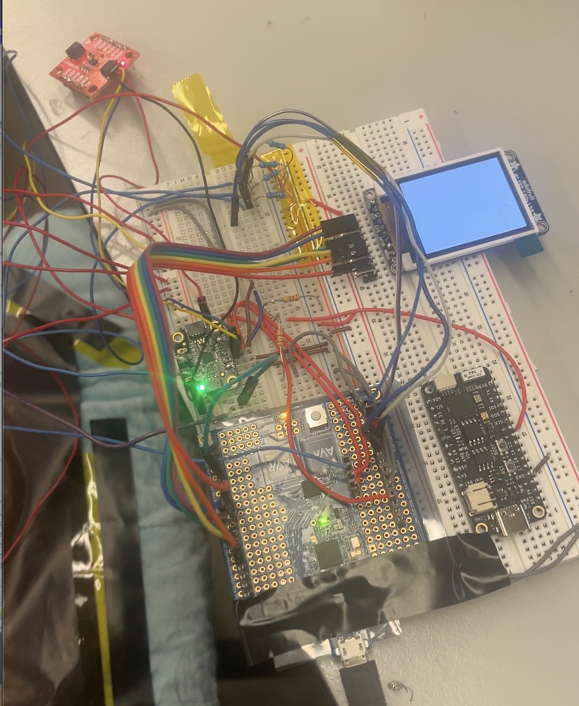
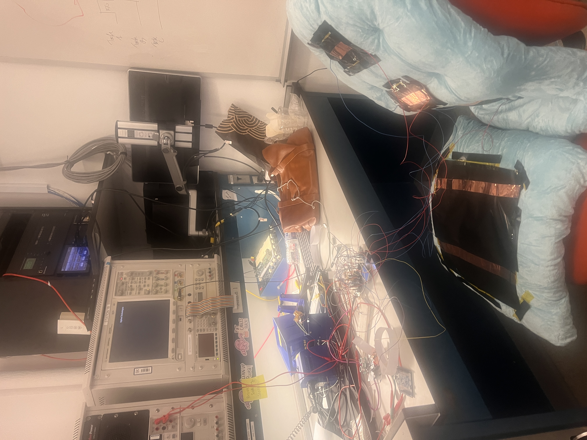
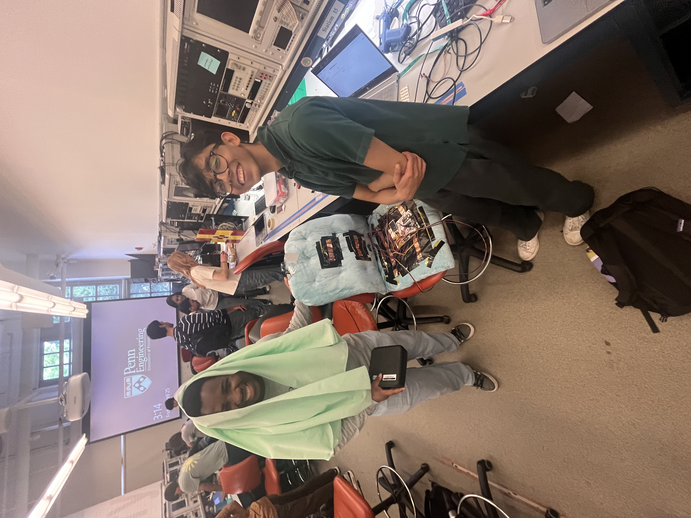
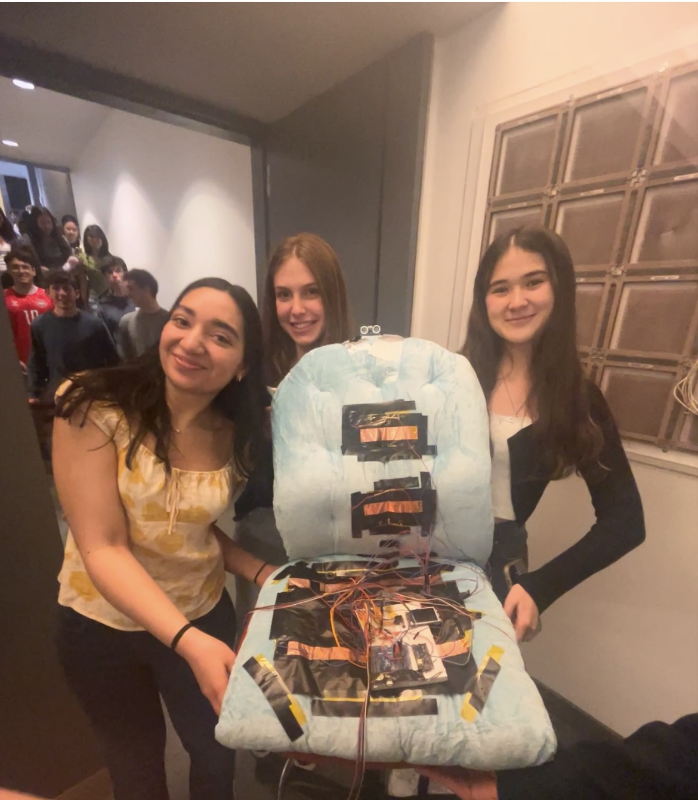

# ESE 3500 Final Project: Slouchbuster

* Team Number: 16
* Team Name: Sam
* Team Members: Saanvi Mehta, Aagam Dalal saanvimmehta
* GitHub Repository URL: https://github.com/upenn-embedded/final-project-s25-sam
* GitHub Pages Website URL: https://upenn-embedded.github.io/final-project-s25-sam/

### 1. Video

**<https://www.dropbox.com/scl/fo/702uyo3b11zsc03u807cp/AIPMQNEChR5ZowI8P7IOuxo?rlkey=1u3yia7crl2wny4mzd332s2i4&st=c8gdctuw&dl=0>**

### 2. Images

### 3. Results

*What were your results? Namely, what was the final solution/design to your problem?*

Our final solution, SlouchBuster, is a real-time posture correction cushion that uses pressure sensors, an ultrasonic sensor, and an IMU to track slouching, leaning, and other poor postural behaviors. The system provides immediate haptic feedback using a motor driver and displays guiding messages on an LCD. It also supports enabling/disabling sensing based on presence detection and includes sensor calibration at startup. While some requirements were adjusted during development (e.g. using a haptic motor instead of a buzzer, and being unable to consistently / accurately define different kinds of posture), our system performed in tracking the user's posture, identifying poor posture, and reacting quickly to it guiding the user.

#### 3.1 Software Requirements Specification (SRS) Results

*Based on your quantified system performance, comment on how you achieved or fell short of your expected requirements.*

**NOTE: our main.c final version is "final_main.c"**

**VALIDATION FOR SRS-01, 02, 03, 05, & 07 is in pictures and videos of serial monitor prints & the lcd screen changes in the validation folder in this link:** https://www.dropbox.com/scl/fo/702uyo3b11zsc03u807cp/AIPMQNEChR5ZowI8P7IOuxo?rlkey=1u3yia7crl2wny4mzd332s2i4&st=t1vhbi3w&dl=0

| ID             | Description                                                                                                                                                                                                                                                                                                 | Validation Outcome                                                                                                                                                                                                                                                                                                                                                                                                                                                                                                                                                                                                         |
| -------------- | ----------------------------------------------------------------------------------------------------------------------------------------------------------------------------------------------------------------------------------------------------------------------------------------------------------- | -------------------------------------------------------------------------------------------------------------------------------------------------------------------------------------------------------------------------------------------------------------------------------------------------------------------------------------------------------------------------------------------------------------------------------------------------------------------------------------------------------------------------------------------------------------------------------------------------------------------------- |
| Example SRS-01 | The IMU 3-axis acceleration will be measured with 16-bit depth every 100 milliseconds +/-10 milliseconds.                                                                                                                                                                                                   | Confirmed, logged output from the MCU is saved to "validation" folder in GitHub repository.                                                                                                                                                                                                                                                                                                                                                                                                                                                                                                                                |
| SRS-01         | The IMU will measure 3-axis acceleration with a sampling rate of 100Hz to capture the user's posture in real-time.                                                                                                                                                                                          | Confirmed, live readings from x, y, and z gyro axes were printed over UART in the final loop. Smoothing filter applied. Logged Output validates this                                                                                                                                                                                                                                                                                                                                                                                                                                                                       |
| SRS-02         | Pressure sensors sampled every 0.5s to track seating changes.                                                                                                                                                                                                                                               | Cofirmed (slightly adjusted to higher frequency readings) Sensors were read every ~60ms as this helped us better track the user's posture & react quicker. Logs in serial monitor validated this                                                                                                                                                                                                                                                                                                                                                                                                                           |
| SRS-03         | The IMU, pressure sensors, and ultrasonic sensor sensing will only begin when the pressure sensors detect over 10% of maximum pressure applied, indicating the user is seated and their posture is being actively tracked. This reduces unnecessary processing when the user is not in the seated position. | Cofirmed (slightly adjusted for more accuracy) Sensors only began sensing after 5 counts of pressure exceeding the threshold was registered in a row. This threshold was dynamically determined from the threshold calibration at the beginning for more consistency working with the pressure sensors, and the 5 counts were spaced by __ ms.                                                                                                                                                                                                                                                                             |
| SRS-05         | The Ultrasonic sensor will continuously measure the distance from the user's back to the cushion at a frequency of once every 0.5 seconds, allowing the system to detect how far the user has slouched                                                                                                      | Confirmed but at a higher frequency for more immediate responses.                                                                                                                                                                                                                                                                                                                                                                                                                                                                                                                                                          |
| SRS-06         | The buzzer will only buzz after bad posture was detected for more than 2 minutes. Until the posture isn’t corrected the buzzer won’t stop.                                                                                                                                                                | Confirmed (greatly adjusted for better design). Instead now we had a haptic buzzer at the users back that automatically buzzed when a user has bad posture. This change was made so that rather than an audio cue the user would get a haptic cue & would get the cue as soon as their posture regresses rather than letting them sit with bad posture for 2 minutes.)                                                                                                                                                                                                                                                     |
| SRS-07         | Depending on what factors triggered the event of bad posture, after 2 minutes, the LCD will display a certain message (e.g. sit back, sit straight, stop leaning, etc.) to help the user “detrigger” the buzzer                                                                                           | Partially done, partially adjusted, partially not able to achieve. We were able to display messages on the LCD to alert to user of when they had good & bad posture (and when they weren't sitting on the chair) - we chose to adjust so that we'd have a faster response to sitting so that the user would only need to wait 5 counts as opposed to 2 minutes for the sensing to begin. What we weren't able to achieve was the different categorizations of bad posture and assigning a unique lcd screen to them because our pressure sensors weren't accurate enough to detect these small pressure shifts on the back |

| ID continued | Description Continued                                                                                                                                                                                                                                                                                                                           | Validation Continued                                                                                                                                                                                                    |
| ------------ | ----------------------------------------------------------------------------------------------------------------------------------------------------------------------------------------------------------------------------------------------------------------------------------------------------------------------------------------------- | ----------------------------------------------------------------------------------------------------------------------------------------------------------------------------------------------------------------------- |
| SRS-08       | Once the seat pressure threshold is passed and sensing begins, the back pressure sensors will be sampled every 0.5 seconds to monitor the pressure distribution across the cushion, enabling the system to detect changes in posture or seating position as quickly as they occur.                                                              | Confirmed (slightly adjusted to higher frequency readings). Sensors were read every ~60ms                                                                                                                              |
| SRS-09       | The system will log posture data (including the time spent in bad posture and the type of posture detected) for historical tracking. This data will be stored locally on the device and optionally synced to a cloud database via ESP32for long-term tracking. The data can be accessed by the user via the mobile app for progress monitoring. | Partially Achieved, we were able to log bad posture & it's duration to a web application via the ESP32, but we were unable to also record the type of bad posture as we were unable to classify it as previously noted. |

#### 3.2 Hardware Requirements Specification (HRS) Results

*Based on your quantified system performance, comment on how you achieved or fell short of your expected requirements.*

**VALIDATION FOR HRS-01, 02, 05, 06,  & 07 (and partially 08 & 03) is in pictures and videos of serial monitor prints, the lcd screen changes, the system as a whole, the imu and pressure sensors, and the esp32 module in the validation folder in this link:** https://www.dropbox.com/scl/fo/702uyo3b11zsc03u807cp/AIPMQNEChR5ZowI8P7IOuxo?rlkey=1u3yia7crl2wny4mzd332s2i4&st=t1vhbi3w&dl=0

| ID     | Description                                                                                                                                                                                                                                                                                                                        | Validation Outcome                                                                                                                                                                                                                                                                                                                                                                                  |
| ------ | ---------------------------------------------------------------------------------------------------------------------------------------------------------------------------------------------------------------------------------------------------------------------------------------------------------------------------------- | --------------------------------------------------------------------------------------------------------------------------------------------------------------------------------------------------------------------------------------------------------------------------------------------------------------------------------------------------------------------------------------------------- |
| HRS-01 | The IMU (Inertial Measurement Unit) shall be able to detect and measure the 3-axis acceleration and rotationwith a sampling rate of 100Hz to accurately track the user’s body orientation (e.g., tilting, slouching, or leaning). This ensures the device detects posture changes in real time.                                   | Confirmed & Implemented                                                                                                                                                                                                                                                                                                                                                                             |
| HRS-02 | The pressure sensors embedded in the cushion shall measure pressure at multiple points across the seating surface with a sampling frequency of 200ms to accurately monitor weight distribution and identify improper posture. The system should be able to detect pressure changes in the range of 0.1-10kg.                       | The pressure sensors were able to detect pressure changes at all points of contact, & at multiple points along the cushion. However, they were not embedded in the cushion as that made them less accurate and were instead secured to the surface of the chair cushion. We sampled the 3 pressure sensors on the cushions at >5 times per second (we estimated the period of the loop to be 60ms) |
| HRS-03 | The ultrasonic sensor shall measure the distance from the user’s back to the cushion with an accuracy of ±1 cmand a response time of less than 1 second. This sensor will help detect forward slouching or posture misalignment by tracking the user's position relative to the cushion.                                         | We were able to achieve this by mounting to top of chair cushion and lenghtening wires for connection. Just did it a t a higher frequency to ensure more real time reactions to changes.                                                                                                                                                                                                            |
| HRS-04 | The buzzer shall provide audible feedback with a sound level of ≥ 70 dB at a distance of 1 meter, ensuring it is loud enough to alert the user when poor posture has been detected for more than 2 minutes. It shall be powered using the same power supply as the other components and be activated via the microcontroller.     | We chose to use a haptic motor instead as we believe it is a more effective means of achieving the same goal of alerting the user. We mounted it to the mid back of the cushion so the user can feel it on their mid back.                                                                                                                                                                         |
| HRS-05 | The LCD display shall have a resolution of at least 128x64 pixels and shall display posture correction messages, such as "Sit Back" or "Sit Straight," when bad posture is detected. The display shall be powered by the ATmega328PB microcontroller and shall be visible under normal lighting conditions from a seated position. | Confirmed & Implemented.                                                                                                                                                                                                                                                                                                                                                                            |
| HRS-06 | The device shall be powered by a laptop connection. The system shall consume less power during normal operation to ensure efficient battery life. A low-power mode shall be enabled when no user activity is detected.                                                                                                             | We achieved a decreased power mode by turning off sensing if the bottom pad of the chair did not detect pressure for 10 counts.                                                                                                                                                                                                                                                                     |
| HRS-07 | The ATmega328PB microcontroller shall be responsible for processing sensor data (from the IMU, pressure sensors, and ultrasonic sensor) and controlling the feedback mechanisms (buzzer, LCD). The microcontroller shall be able to handle real-time processing and provide feedback.                                              | Achieved. Confirmed with the quick LCD reaction to real time events.                                                                                                                                                                                                                                                                                                                                |
| HRS-08 | The ESP32 module shall enable wireless communication for syncing posture data with a mobile app via Wi-Fi.                                                                                                                                                                                                                         | We implemented this on an online application rather than a mobile app.                                                                                                                                                                                                                                                                                                                              |

### 4. Conclusion

This project was a comprehensive and rewarding experience that pushed us to apply embedded systems concepts to a real-world health-related use case. Through designing and implementing SlouchBuster, we learned how to integrate multiple sensors and peripherals (including an IMU, ultrasonic sensor, LCD, pressure sensors, and a haptic motor) into a cohesive and responsive system. One of the biggest successes of our project was that every peripheral we planned to integrate in our project we were able to integrate at some level and get to work reliably / contribute in some manner to our overall device: the LCD displayed real-time posture feedback, the IMU helped detect tilting, seat pressure sensor accurately detected if someone was sitting, back pressure sensors provided an accurate assesment of if there was weight on the different parts of the back, the ultrasonic sensor supported distance-based classification, and the haptic motor provided immediate and ergonomic user alerts. We're especially proud of achieving full system integration and real-time posture tracking, only doing peripheral sensing when necessary, having quick response times, & getting unreliable pressure sensors to be reliable by doing calibration of thresholds in the beginning. We're also proud of implementing wireless data logging to an online dashboard via the ESP32.

Throughout the project, we encountered several unexpected challenges, seemingly at every step of the way, we really with working with our pressure sensors which had a steep learning curve as they weren't very accurate & were working consistently but in a way that was opposite of what was expected. Then at our integration steps we were running into accuracy errors with our ultrasonic sensor and imu despite them working independently. We had to move away from software delay assumptions and carefully manage ISR-driven logic to get consistent performance. We also discovered that physical wiring and mechanical layout played a much larger role in system stability than we gave it credit for earlier on, especially as components shifted during testing. In response, we adapted our approach by repositioning components for reliability and focusing more on live serial debugging to isolate logic issues.

In hindsight, we could have allocated more time earlier for mechanical stabilization and packaging, which became a significant concern during integration. We also had to compromise on some stretch goals, such as categorizing specific types of bad posture (leaning vs. slouching), due to the limitations of our pressure sensor setup due to inaccuracy of pressure sensors & the imu having issues last minute. However, the system still achieved its main goal of detecting poor posture and prompting timely helpful feedback.

Looking forward, there are several meaningful next steps. We could further refine the posture classification logic to distinguish between multiple types of poor posture using more advanced algorithms or ML. Enhancing the online dashboard with richer analytics and developing a more robust mechanical design would also move SlouchBuster closer to a market-ready product.

## References

LCD Library from Lab 4
